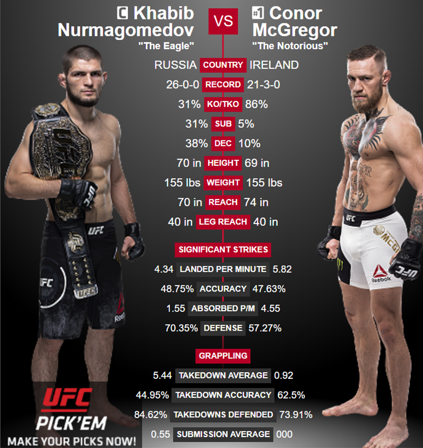

# UFC Winner Predictor - Artificial Neural Network

Artificial neural network that predicts who will win a UFC contest between two fighters. The dataset used to train the neural network contains a vareity of statistics about fights dating back to as far as 1993 (when the UFC started collecting data), along with in-depth stats about each fighter. The statistics relating to each fighter that were used to train the neural network are as follows: current lose streak, current win streak, total draws, longest win streak, total losses, total draws, total rounds fought, total time fought (seconds), total title bouts, number of wins by decision (majority), number of wins by decision (split), number of wins by decision (unanimous), wins by KO/TKO, wins by submission, wins by doctor stoppage, total wins, stance, height (cm), reach (cm), weight (lbs), and age. Once trained, the user can enter statistics about two fighters in question, all of which can be found at [ufcstats.com](http://www.ufcstats.com/fighter-details/f4c49976c75c5ab2), and the neural network will give you its prediction as to who will win the fight, as well as the chance, expressed as a percentage, that it attributes to each fighter winning the contest. Predictions were made with 59-63% accuracy when predicting the test set values. (NOTE: This prediction algorithm preforms the same overall function as the project titles, 'UFC Winner Predictor XGboost.' The differences between the two are that this model was trained using forward/backward propagation, while the other was trained with a gradient boosting algorithm) 

## Getting Started
### Prerequisites
* Anaconda (Python 3.7 Version)
  - [Anaconda Instillation Instructions](https://docs.anaconda.com/anaconda/install/)
  - Using Anaconda is optional, I simply chose to use this distribution for the Spyder environment that is included

### Packages to Install
* pandas - software library for data manipulation and analysis
  - `conda install -c anaconda pandas`
* numpy - general-purpose array-processing package
  - `conda install -c anaconda numpy`
* scikit learn - machine learning library
  - `conda install -c anaconda scikit-learn`
* keras - neural network library
  - `conda install -c conda-forge keras`
* sklearn_pandas - provides a bridge between scikit-learn's machine learning methods and pandas Data Frames
  - `conda install -c gwerbin sklearn-pandas`
  
## Running the tests
* First, open the 'Data' folder, download UFCdata.zip, and extract UFCdata.csv (NOTE: there is another file in the .zip titled, 'Unedited UFCdata.csv'. This is the original file that was returned when the UFCstats website was scraped using Beautiful Soup. I didn't chose to include all of the information about the contest/fighters that UFCstats.com provided, so I deleted some of the columns, only keeping the ones that I felt were relevant, and saved this new file as 'UFCdata.csv'. Should you desire, you can use 'Unedited UFCdata.csv' to include any other information that I may have deleted about the contest/fighters when I created 'UFCdata.csv')
* Once downloaded, copy/paste the code into Spyder, and run the entire program. (NOTE: When splitting the data into the training and test sets, I set the test size to be created with 0.05 % of the available data. When fitting the neural network to the training set, I used a batch size of 10, with 6 hidden layers and 25 total epochs. There is no correct value for these hyper-parameters, and they can be experiemented with to see which values return the greatest prediction accuracy.)
* Once the neural network has finished training itself, you will be asked if you would you like to have it make a predicition based on user-defined data. If you type 'no', the program will end. If you type 'yes', you will be prompted to enter a variety of information about each fighter in question. The program doesn't categorize fighters by name, it simply labels them as the red corner fighter and the blue corner fighter. If you are attempting to predict an upcoming UFC fight, then UFCstats.com will tell you which fighter is fighting out of the blue corner, and which is fighting out of the red. If this isn't a real-life fight, then the user determines who will be the red and blue fighters. Whether or not a fighter is assigned to be red or blue will not affect the predicition. 
* Once all data pertaining to each fighter has been entered, the ANN will give its prediction as to who will win the fight, as well as the chance, expressed as a percentage, that it attributes to each fighter winning the contest. 

## Prediction Accuracy
* Accuracy varies each time the model is retrained, but on average, the model made predictions about the test set with 59-63% accuracy (predictions were verified by comparing them to the real life outcomes, found in the test set). 59-63% accuracy may not seem like a lot initially; however, as stated by Betfile.com, "Professional bettors can rarely do better than a 58% winners over the long term, and many won’t even achieve that number. Take ‘bettor A’ who manages e.g. a winning percentage of 60% winners (somehow!). If bettor A has ten bets on the handicap and wins six of them, losing four, then A has done amazingly well." To read the whole article, visit [Betfile.com](http://betfile.com/winning-percentages-in-betting/). 
* With this in mind, 59-63% prediction accuracy on the test set is a very high win percentage, and if generalized to the real world, would result substantial profits.

* Prediction accuracy is represented by the following confusion matrix. Accuracy can be calculated by summing the bottom left and top right values, then dividing this value by the the sum of the top left and bottom right values.

## Authors
* **William Schmidt** - [Wil's LikedIn](https://www.linkedin.com/in/william-schmidt-152431168/)

## Acknowledgments

* Huge shoutout to Rajeev Warrier for scraping this data from the UFCstats website using Beautiful Soup! I did not use any of his preprocessed data files, simply the raw dataset, and then preprocessed it myself. I can't thank him enough for providing this dataset on Kaggle!
* [Rajeev's Kaggle Profile](https://www.kaggle.com/rajeevw)
* [Rajeev's Github Profile](https://github.com/WarrierRajeev?tab=repositories)
